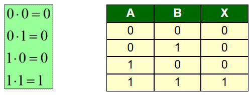
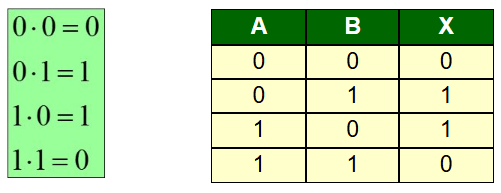
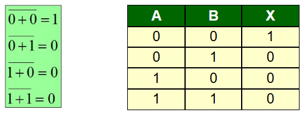
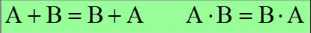
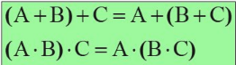
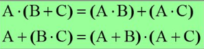
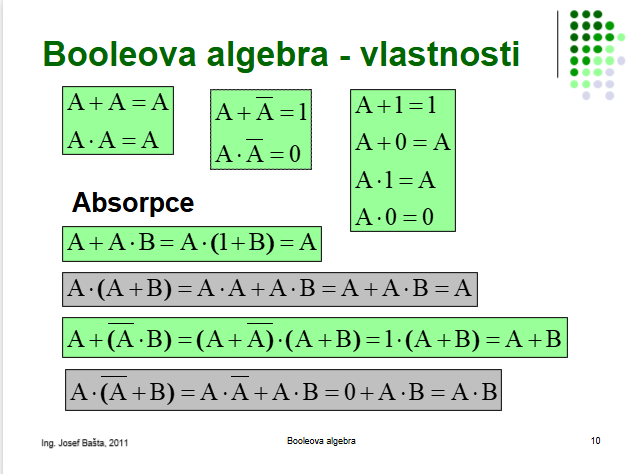
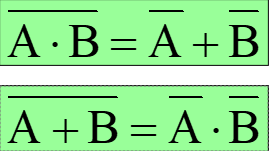

- # **Booleova algebra**
	je oblast matematiky, která se zabývá **logickými hodnotami** a **operacemi s nimi**. Používá se hlavně v **informatice, elektronice a logice**, například při návrhu **logických obvodů** nebo **programování podmínek**.

- Je algebra pracující: s logickými hodnotami 0 a 1

## Základními operacemi:
-  negace
- logický součet
- logický součin

###  Negace
- **NOT**                                                   Pravděpodobnostní tabulka	

### Logický součet 
- **OR - nebo**
- disjunkce                                         Pravděpodobnostní tabulka
 

### Logický součin
- **AND - a (zároveň)**
- konjunkce                                    Pravděpodobností tabulka	

###  Výlučný logický součet
- **XOR**                                            Pravděpodobností tabulka	

### Negovaný logický součet
- **NOR**                                             Pravděpodobností tabulka	

### Negovaný logický součin 
- **NAND**                                          Pravděpodobností tabulka	

### **Komutativnost**              
 
### **Asociativita**

### **Distributivnost**

### **Vlastnosti**

### **De Morganovy zákony**

### Příklad 231.1
	$Z=B\cdot\left(\overline{C+D}\right)+A\cdot B\cdot\left(\overline{C+D}\right)=$
		- Výsledek je $Z=B\cdot\overline{C}\cdot\overline{D}$
